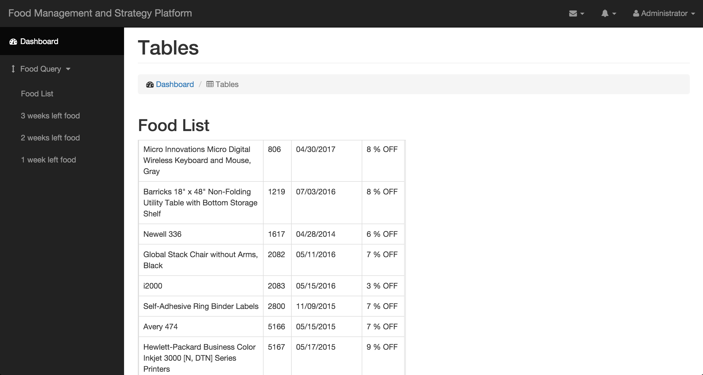
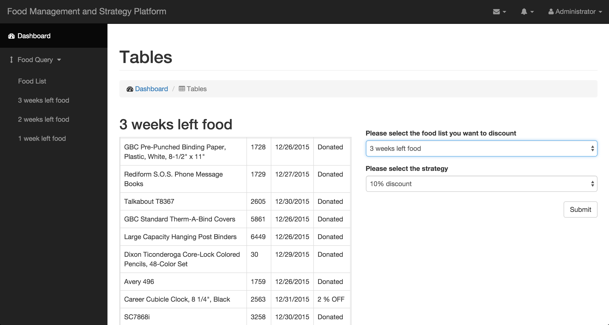
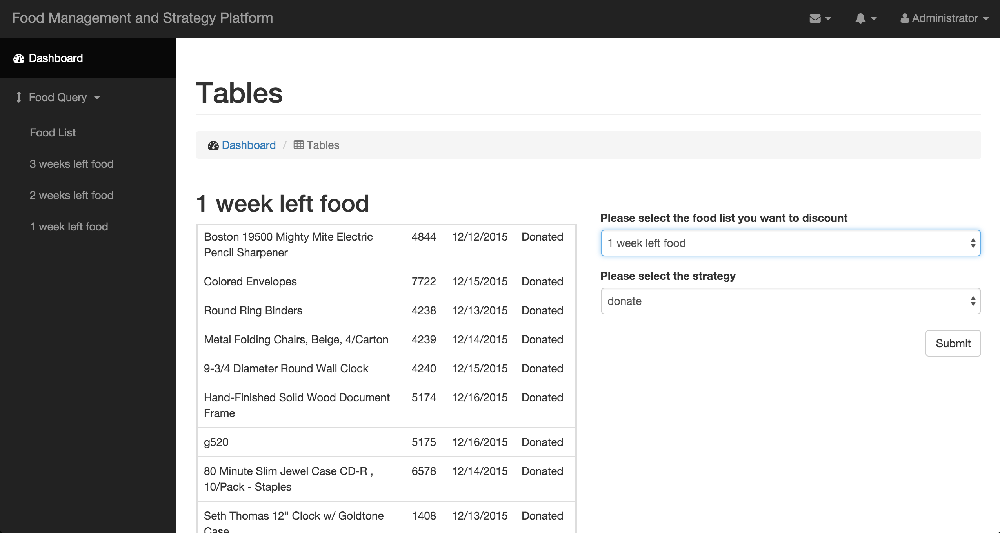
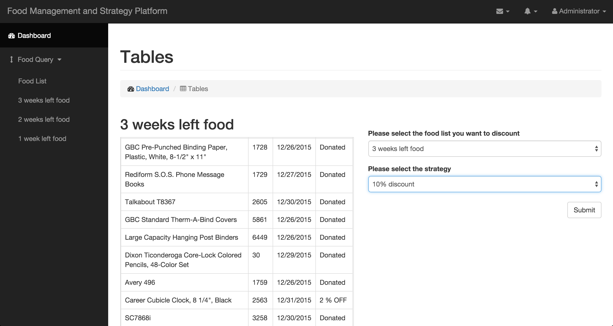
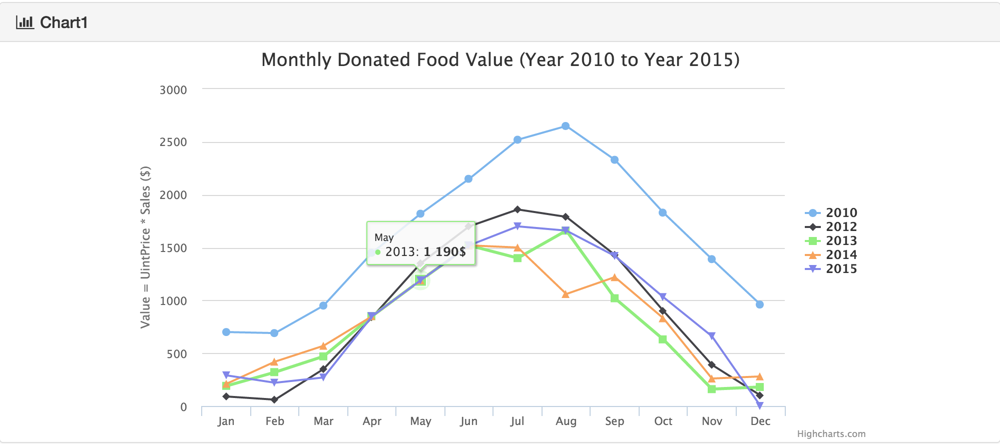
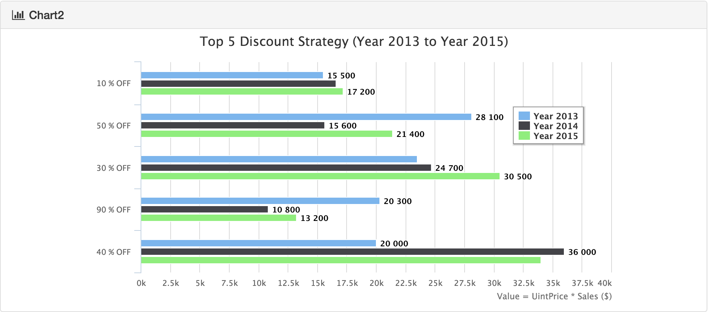
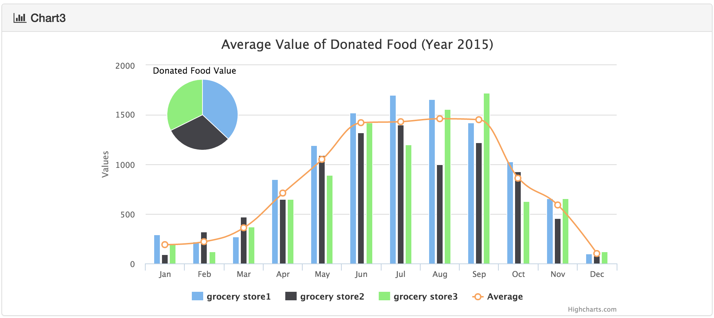
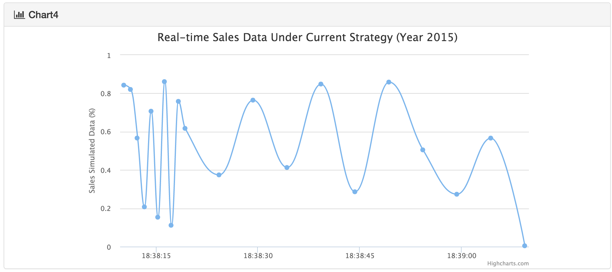

#Food Management and Strategy Platform#

##Abstract##

The food management and strategy platform is a business level platform. Shopping mall such as Safeway uses this platform to track products expiration date and query products at any time so they can make options to deal with these products. It's an efficient way to avoid food wasting at the same time helping shopping mall gain a good reputation.

##Project Environment and Run##

Bootstrap + jQuery + Ajax + Spring MVC + MongoDB

Run:

Open Intellij

Import, select pom.xml

Run it on tomcat

##Login##

##Query##

**Food List:** user can see all food products here.

**3 Weeks Left Food List:** user can see food products which expiration date is 14~21 days after the query date here.

**2 Weeks Left Food List:** user can see food products which expiration date is 7~14 days after the query date here.

**1 Week Left Food List:** user can see food products which expiration date is 0~7 days after the query date here.

##Set Strategy##

User can make decisions about the sales according to the query.

##Analysis##

**Monthly donated food value analysis**
The grocery donate expired food every month, but they never know how much food they donated, and whether they need to donate more in the next month. For helping them make better business decisions, we build a data analytics system that will tell you the food value you donated each month. Everything you donated is on the single graph, which help you to make smart decisions 

**Discount strategy analytics platform**
To make smart discount strategy for the future, you must analyze the precious discount strategy and the sales situation under this discount strategy. The overall discount strategy in the past is in the data, we built a visualization tool for you to analyze the discount strategy, and help you decide what strategy you are going to take in the future.

**Average donated food analysis**
Besides the tools we have above, we also built a tool to analyze the average donated food value. This is a complement to the monthly donated food analysis, and will help the user to make business strategy.

**Real time sales data analysis**
The only criteria to judge if a business strategy is successful or not is the sales data under current strategy. In order to help user make quick and smart business decisions, we built a sales data analysis tool. The sales data displayed is the real time sales data under the strategy you set. If you found the strategy does not work, you can simply change the strategy really quick, and see how it works under the new strategy. But adjusting the strategy, we help the user maximize their profits.

##Database Design##

>AccountInfo {

    String id
    String email
    
}

>Food {

    private int rowID;
    private String productName;
    private String expirationDate;
    private double discount;
}

>Rule {

    int daysBefore; // days before expiration
    String action;
}

>Notification {

    Food food;
    Rule rule;
}

>Registration {

    "/register", method = RequestMethod.POST;
    http://localhost:8080/register?name=user1&password=user1;
    return	return user's accountInfo;

}

>Food List {

    "/food/", method = RequestMethod.GET
    get all the food

    "/food/expired", method = RequestMethod.GET
    get all the food that will expire within 3 weeks

    "/food/expired/{days}", method = RequestMethod.GET
    days: 21, 14, 7
    21: get all the food that will expire from 2 weeks later to 3 weeks later
    14: get all the food that will expire from 1 week later to 2 weeks later
    7: get all the food that will expire within 1 week
    
}

>Set strategy {

    "/food/expired/{days}/{discount}", method = RequestMethod.POST
    days: 21, 14, 7
    21: get all the food that will expire from 2 weeks later to 3 weeks later
    14: get all the food that will expire from 1 week later to 2 weeks later
    7: get all the food that will expire within 1 week
    discount: 9: 90 % OFF,  1: 10 % OFF, -1: Donated
    return "SUCCESS", "FAIL"
     "/food/analysis/donation", method = RequestMethod.GET
     {
     "years": [
     "2015",
     "2016",
     "2017",
     "2018",
     "2019"
     ],
     "numbers": [
     1838,
     1749,
     1846,
     0,
     0
      ]
      }
     "/food/analysis/discount/top", method = RequestMethod.GET
     [
     {
     "disCountMsg": "1 % OFF",
     "count": 800
     },
     {
     "disCountMsg": "5 % OFF",
     "count": 782
     },
     {
     "disCountMsg": "3 % OFF",
     "count": 774
     },
     {
     "disCountMsg": "9 % OFF",
     "count": 774
     },
     {
     "disCountMsg": "4 % OFF",
     "count": 766
     }
     ]
    "/food/analysis/discountstat", method = RequestMethod.GET
    [
    {
    "year": "2015",
    "off10": 155,
    "off50": 0,
    "donation": 0
    },
    {
    "year": "2016",
    "off10": 166,
    "off50": 0,
    "donation": 0
    },
    {
    "year": "2017",
    "off10": 172,
    "off50": 0,
    "donation": 0
    },
    {
    "year": "2018",
    "off10": 0,
    "off50": 0,
    "donation": 0
    },
    {
    "year": "2019",
    "off10": 0,
    "off50": 0,
    "donation": 0
    }
    ]
